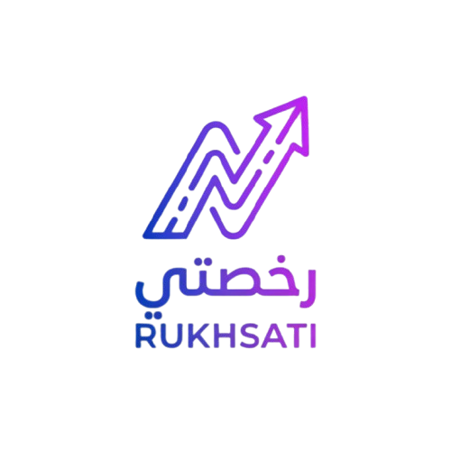

# رخصتي (Rukhsati) 🚦

  

 

## Project Overview
Rukhsati is an interactive, gamified web application designed to help users prepare for their driving license tests by learning and practicing Arabic traffic signs and road laws in an engaging environment.

## Problem Statement
- Traditional methods of studying for driving tests (like reading manuals) are often dry and unengaging.
- Learners frequently struggle to visualize traffic rules and signs in real-world contexts.
- There is a lack of high-quality, modern, and interactive Arabic platforms dedicated to localized driving test preparation.

## Proposed Solution
1. Users select from three progressive difficulty levels (Easy, Medium, Hard).
2. The application presents interactive quiz questions with multiple-choice answers in full Arabic (RTL).
3. Questions are accompanied by real-world, high-definition Jordanian traffic sign images directly from a Kaggle dataset.
4. Immediate visual and textual feedback is provided for each answer.
5. A dynamic HUD tracks score, progress, and remaining lives (hearts).
6. A responsive 3D animated road scene with a moving detailed SVG car provides an immersive backdrop.

## Core Features
- **Gamified Learning System:** Three difficulty tiers with life-tracking and point-scoring mechanics.
- **Real-World Scenarios:** Integration of actual high-definition traffic sign images instead of generic icons.
- **Dynamic Animations:** Real-time CSS and SVG animations, including moving road dashes, glowing headlights, and exhaust smoke effects.
- **Glassmorphism UI:** A premium, modern visual aesthetic featuring translucent panels and deep, soft colors.
- **Full Arabic Layout:** Native RTL support utilizing customized Arabic typography ('Cairo' and 'Tajawal' fonts).

## Project Scope
**Included:**
- Gamified quiz mechanics and score tracking.
- Interactive animations and dynamic SVG vehicle models.
- Real-world image integration for traffic signs.
- Comprehensive localized JSON data source for questions and road laws.

**Excluded:**
- User account creation and authentication.
- Persistent backend database integration (runs entirely client-side).
- Official test booking or integration with governmental traffic departments.
- Mobile application (web-based responsive design only).

## Technical Stack
- **Frontend:** React 18
- **Build Tool:** Vite
- **Styling:** Vanilla CSS3 (Variables, Flexbox, CSS Grid, Keyframes)
- **Data Source:** Custom localized JSON arrays & Kaggle Image Datasets

## References
- [Jordanian Traffic Signs Dataset (Kaggle)](https://www.kaggle.com/datasets/khaledhweij/jordanian-traffic-signs)
- Modern UI/UX Glassmorphism Design Trends
- CSS Keyframe Animation Best Practices
